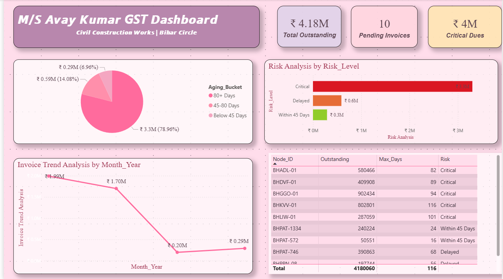
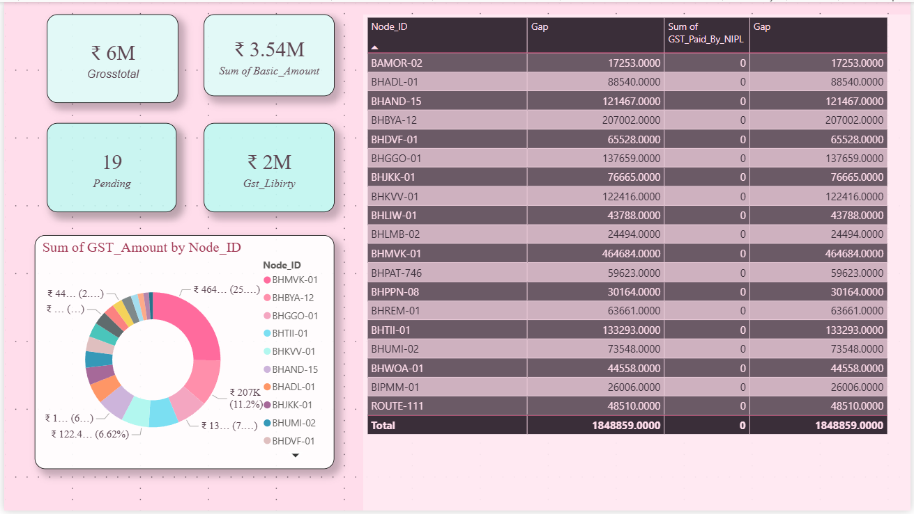

#  GST Outstanding Dashboard — M/S Avay Kumar


##  Project Overview

This Power BI dashboard provides a complete **GST outstanding and invoice analysis** for M/S Avay Kumar — a Civil Construction company operating in Bihar Circle.

The dashboard helps track **pending invoices, outstanding amounts, and risk levels** across multiple nodes — enabling faster decision-making and recovery actions.

---

##  Dashboard Preview

### Dashboard 1 — GST Outstanding & Risk Analysis


### Dashboard 2 — GST Amount & Gap Analysis


---

## 📌 Key Metrics

| Metric | Value |
|--------|-------|
| Total Outstanding | ₹ 4.18M |
| Pending Invoices | 10 |
| Critical Dues | ₹ 4M |
| Gross Total | ₹ 6M |
| Sum of Basic Amount | ₹ 3.54M |
| GST Liability | ₹ 2M |
| Total Pending Nodes | 19 |

---

##  Dashboard 1 — Features

### 1. Aging Bucket Analysis (Pie Chart)
- **80+ Days** — ₹ 3.3M (78.96%) — Critical zone
- **45-80 Days** — ₹ 0.59M (14.08%) — Delayed
- **Below 45 Days** — ₹ 0.29M (6.96%) — Within limit

### 2. Risk Analysis by Risk Level (Bar Chart)
- **Critical** — ₹ 3.3M (Highest risk)
- **Delayed** — ₹ 0.6M
- **Within 45 Days** — ₹ 0.3M

### 3. Invoice Trend Analysis (Line Chart)
- Monthly trend from invoice date
- Peak outstanding at ₹ 1.99M
- Gradual recovery trend visible

### 4. Node-wise Outstanding Table
- Node ID wise breakup
- Outstanding amount per node
- Maximum days outstanding
- Risk level classification

---

##  Dashboard 2 — Features

### 1. Summary KPI Cards
- Gross Total, Basic Amount, Pending Count, GST Liability

### 2. GST Amount by Node ID (Donut Chart)
- Node-wise GST distribution
- BHMVK-01 highest at ₹ 464K (25%)
- BHBYA-12 second at ₹ 207K (11.2%)

### 3. Gap Analysis Table
- Node ID wise GST gap
- GST paid by NIPL
- Net gap amount per node
- **Total Gap — ₹ 18,48,859**

---

##  Tools & Technologies

| Tool | Usage |
|------|-------|
| **Power BI Desktop** | Dashboard creation & visualization |
| **Microsoft Excel** | Data source & preprocessing |
| **DAX** | Calculated measures & KPIs |
| **Power Query** | Data cleaning & transformation |

---

##  Project Structure

```
GST-Dashboard-PowerBI/
│
├── dashboard1.png          # GST Outstanding Dashboard screenshot
├── dashboard2.png          # GST Gap Analysis Dashboard screenshot
├── README.md               # Project documentation
└── GST_Dashboard.pbix      # Power BI file (main project)
```

---

##  Key Insights

- **78.96%** of total outstanding is older than 80 days — immediate action required
- **BHGGO-01** has highest outstanding at ₹ 9,02,434 with 94 days overdue
- **BHMVK-01** has largest GST gap at ₹ 4,64,684
- **Zero GST paid by NIPL** across all nodes — total gap equals total outstanding
- Invoice trend shows declining pattern — recovery efforts may be working

---

##  Business Value

This dashboard helps the company to:
- Identify **critical outstanding** nodes instantly
- Track **aging of invoices** — 45, 80+ days buckets
- Monitor **GST liability gaps** node-wise
- Take **faster recovery decisions** based on risk level
- Reduce manual Excel reporting time by **70%+**

---

##  How to Use

```
1. Download the .pbix file
2. Open in Power BI Desktop
3. Connect to your Excel data source
4. Refresh data
5. Dashboard auto-updates!
```

---

##  Author

**Data Analytics & Power BI Developer**
📍 Delhi, India
🔗 Connect on LinkedIn

---

##  Note

> Data used in this dashboard is for **practice and portfolio purposes**.
> Node IDs and amounts have been used from sample construction industry data.

